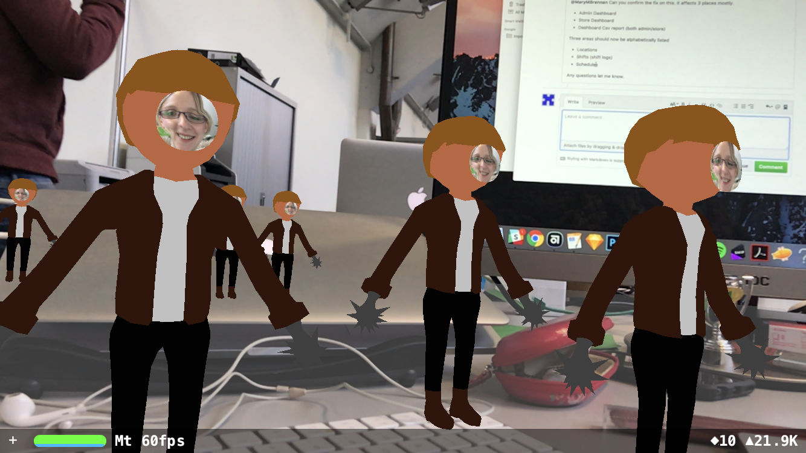
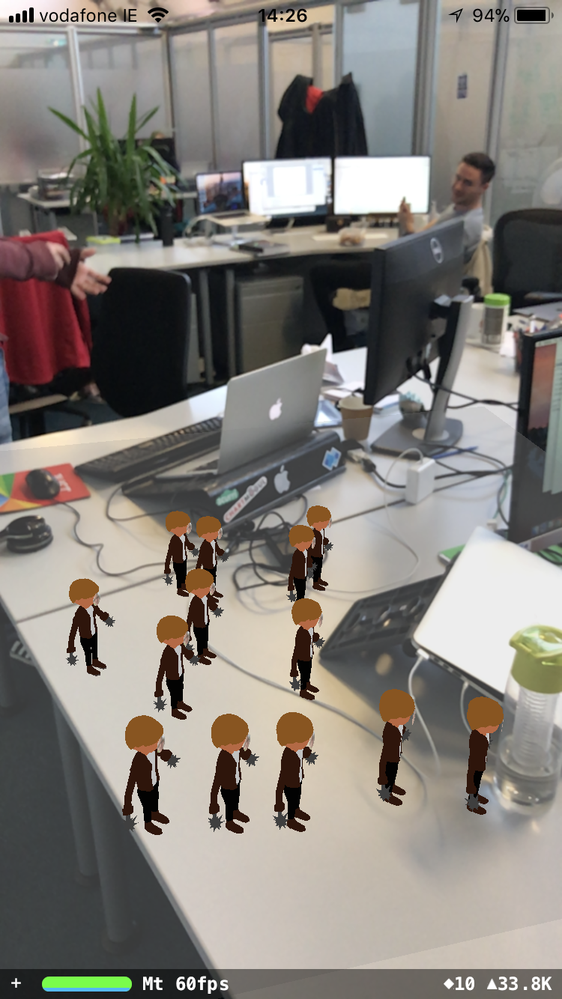

# ElfYourselfOnAShelf
A basic Xcode project to demonstrate some ARKit capabilities at the Dublin Digital Hub Developer Lunch &amp; Learn.

## Resources

[Low Poly Man model](https://www.turbosquid.com/3d-models/free-obj-mode-man-hat-pan/1030397)

[Blender 3D Creation Suite](https://www.blender.org)

[Digital Leaves ARKit Tutorials](https://digitalleaves.com/blog/category/arkit/)

[How To properly export 3D model for use in SceneKit - Blender Stack Exchange](https://blender.stackexchange.com/questions/14584/properly-export-collada-for-use-in-scenekit)

[How to add Image as texture in SceneKit - Stack Overflow](https://stackoverflow.com/questions/36065957/want-to-add-image-as-texture-in-scenekit-ios)

